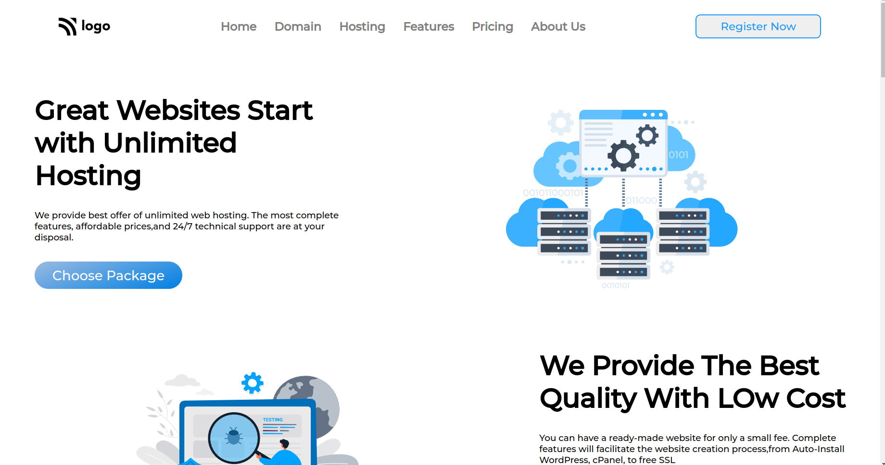
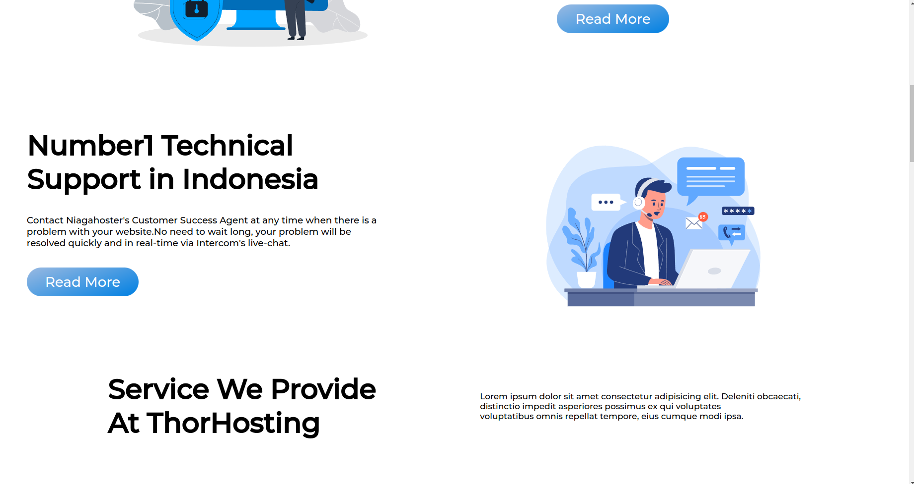
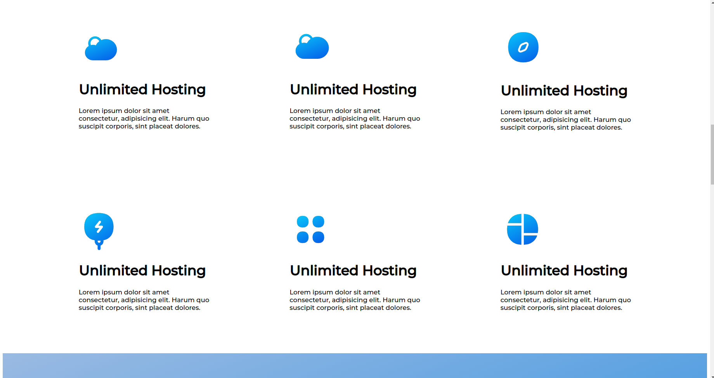
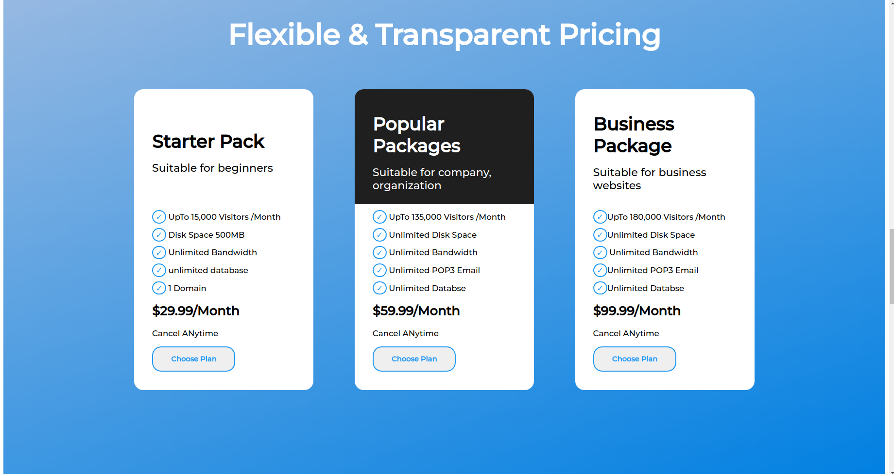
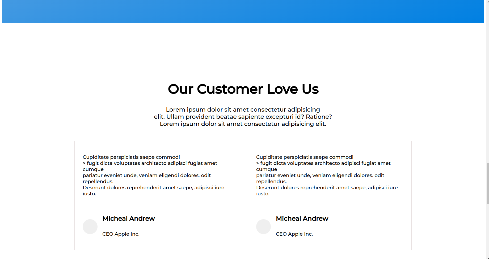
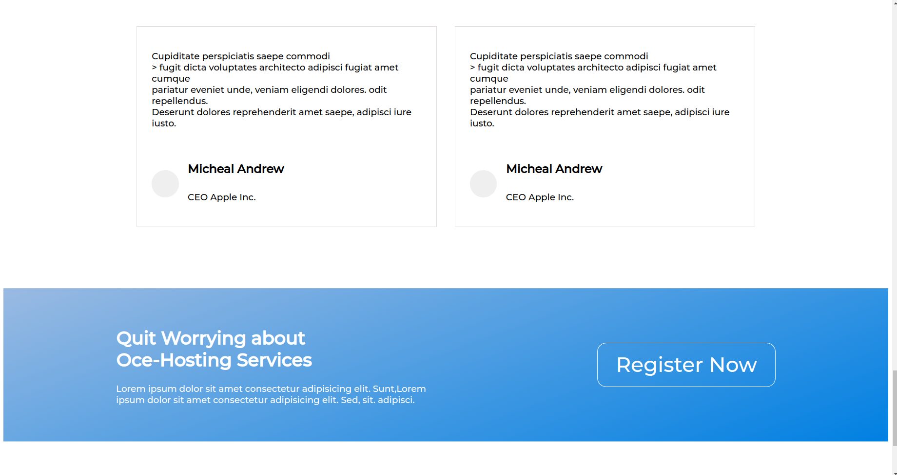
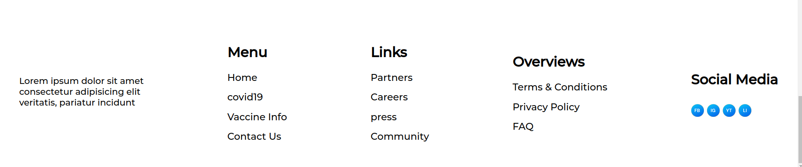

## My Name

### JYOTI SINGH

## PROJECT NAME

### Hosting Landing Page

## About

- ### Used HTML And CSS.
- ### Style by flex-box .
- ### Responsive.

## WHAT I LEARN FROM THIS PROJECT?

- ### Learn .svg file seperation.
- ### Practicing on Media Query.
- ### Explore on vw an vh unit.
- ### 2 times of code-modification done.

## TIME TAKEN TO COMPLETE

- ### First-time it takes 4-5 hour
- ### second-time it takes 2hour modification.

## PHOTOS

### WEBSITE LINK

[Visit Link](https://hosting-landing-page-01.netlify.app/)
